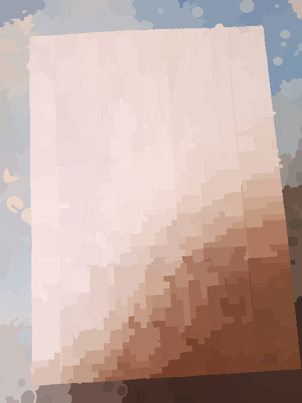
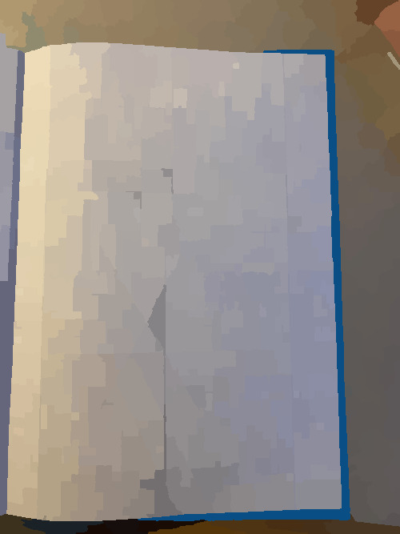
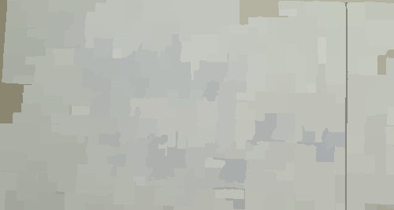
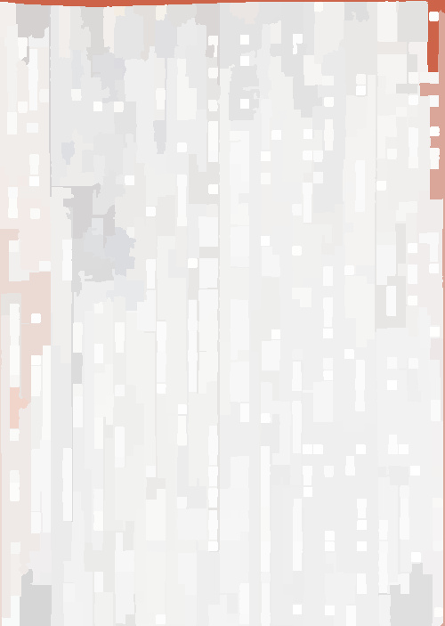
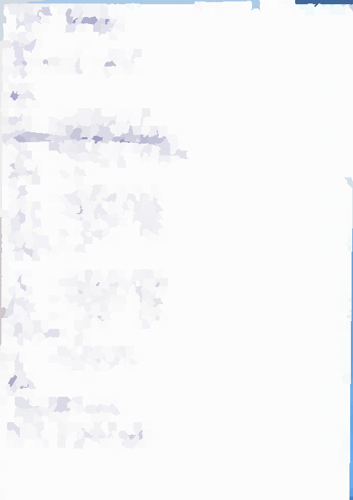

Wird die Verbesserung digital über den Link abgegeben, stellt ein Algorithmus vor dem Upload sicher, dass die Bildqualität entsprechend gut ist. Wenn ein Dokument nicht den visuellen Qualitätsansprüchen genügt, dann wird der Upload automatisiert abgelehnt. Nach erfolgreichem Upload der Abgabe wird ein Zeitstempel angezeigt.

## Beispiele für gute und schlechte Scans
### Schlechte Scans

### Gute Scans

## Wie erstelle ich gute Scans von Dokumenten

### Aufnahme mit einem Scanner

Die beste Bildqualität lässt sich mit einem konventionellen Scanner erreichen. Wer ausserhalb der Schule keinen Zugriff auf einen Scanner hat, der hat die Möglichkeit mit einem USB-Stick, auf Nachfrage bei der Lehrkraft, darauf Scans der Abgaben in der Schule zu speichern.

### Aufnahme mit einer Scanner-App

Es gibt unzählige Apps, mit denen aus einem Foto ein Dokument extrahiert und visuell verbessert werden kann. Bei der Wahl einer entsprechenden App sollte nach persönlichen Vorlieben recherchiert und ausgewählt werden. Im Folgenden ein paar examplarische Empfehlungen:


* {{ details.name }}: [Android]({{ details.android }}) | [iOS]({{ details.ios }})


_**Durch die Nutzung einer Scanner-App im A4-Hochkant-Format bei guter Beleuchtung entspricht die Abgabe mit hoher Wahrscheinlichkeit den visuellen Qualitätsansprüchen.**_